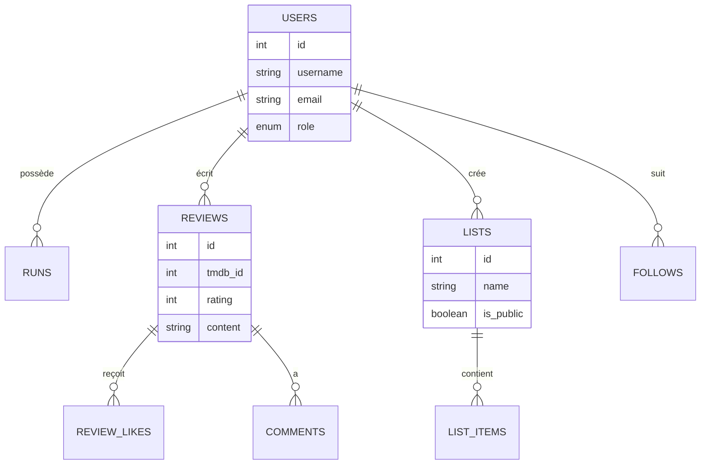

# Schéma de Base de Données

La base de données est structurée autour des utilisateurs et de leurs interactions avec les œuvres culturelles.

## Tables Principales

### 1. Utilisateurs (`users`)
Stocke les informations de compte et de profil.
- `id` : Identifiant unique.
- `username`, `email` : Identifiants de connexion.
- `password` : Mot de passe haché (bcrypt).
- `role` : 'user' ou 'admin'.
- `role` permet de gérer les permissions (accès au dashboard admin).

### 2. Bibliothèque (`lists`, `list_items`)
Permet aux utilisateurs d'organiser leur collection.
- `lists` : Conteneur (ex: "Mes favoris", "À voir").
    - `is_system` : Indique si c'est une liste par défaut gérée par l'app.
- `list_items` : Lien entre une liste et une œuvre TMDB.
    - `status` : État de l'œuvre (planned, watching, completed, dropped).

### 3. Social (`reviews`, `review_likes`, `comments`)
Gère les interactions communautaires.
- `reviews` : Critiques rédigées par les utilisateurs sur une œuvre.
    - Contient la note (`rating` 1-5) et le texte.
- `review_likes` : Table de liaison pour les "J'aime".
- `comments` : Commentaires textuels sous une critique.

### 4. Réseau (`follows`)
Système d'abonnement unidirectionnel.
- `follower_id` suit `following_id`.

### 5. Administration (`reports`, `notifications`)
- `reports` : Signalements de contenu par les utilisateurs pour modération.
- `notifications` : Historique des événements (nouveau like, abonné, etc.).

### 6. Cache (`media_cache`)
Optimisation pour limiter les appels à l'API TMDB.
- Stocke le JSON brut renvoyé par TMDB pour une durée déterminée.

## Diagramme Relationnel Simplifié (Mermaid)

